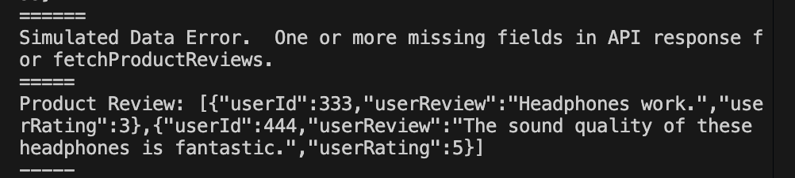

## Critical Thinking Questions

1.  Why is it important to handle errors for each individual API call rather than just at the end of the promise chain?

Errors handling should give feedback as to what specifically caused the error.  Given that, it's simply easier to handle errors for each individual API call, giving feedback about that particular API failing, rather than handling errors at the end of the promise chain, by which time any number of errors may have caused failure.

2.  How does using custom error classes improve debugging and error identification?

Custom error classes can give specific details about what caused an error, making error identification and resolution quick.  Assuming the custom error class message was well written, one need only look at what specific part failed, and how that part connects to others, to trace the point of failure.

3.  When might a retry mechanism be more effective than an immediate failure response?

Where API calls are concerned, retry is often going to be better than immediate failure.  There's any number of reasons why an API request may not be immediately met; natural lag, extra lag from heavy system use.  No reason to shut things down because there's no immediate response.

There's exceptions though; bad request or not found are issues that can't be fixed with retry, and servers may limit requests so simply retrying may actually be counterproductive.

## Screenshots

Long story short, everything works, including optional challenge.  I tweaked code to demonstrate some functionality, then changed back so errors wouldn't constantly trigger (for Data Error and retryPromise).

Note:  We were instructed to write fetchProductCatalog() and fetchProductReviews(productId: number).  Rather than importing data separately, I used the return on fetchProductCatalog to invoke fetchProductReviews.  In first screenshot, product reviews display after sales report.

;

Below screenshot, simulated failure to fetch product catalog results in no product reviews being fetched (getchProductReviews is not even invoked).  This is intended.

;

Below screenshot, simulated network failure of sales API call only, demonstrating success/failure of API calls is independent.

;

Below screneshot, simulated network failure of product 1 API call, demonstrating success/failure of API calls is independent for products.

;

Below screenshot of change to data to test simulated data error for API product catalog.  Note price data is not 'missing', but is set to 0.  This and the empty string, or any value evaluating to falsy, results in a data error.  This is intended.  I think Typescript will require some value be used, and changing code so 'void' or 'null' are allowed values would be odd.  If price of 0 (or other values evaluating to falsy) ought to be allowed, the code can be changed.

;

Below screenshot of simulated data failure for product catalog request, using data rewritten as in above screenshot. 

;

Below screenshot of change to data to test simulated data error for product review, this time using an empty string.

;

Below screenshot of simulated data failure for product review request, using data rewritten as in above screenshot.

;

Below screenshot of tweak to random number generator to increase probability of simulated network errors.

;

Below screenshot of retryPromise functioning.

;

## Comments

The same issue came up as with lab 1; including more details this time.

With 'import { fetchProductCatalog, fetchProductReviews, fetchSalesReport } from "./apiSimulator";' in index.ts, upon attempting 'node index.ts' in Bash, received message

'(node:14369) Warning: Failed to load the ES module: /Users/(user)/(location)/2025-RTT-30/2025-07-11-Lab-2/index.ts. Make sure to set "type": "module" in the nearest package.json file or use the .mjs extension.'

Changed package.json from  "type": "commonjs", to "type": "module".

On attempting in bash node index.ts

node index.ts
node:internal/modules/esm/resolve:274
    throw new ERR_MODULE_NOT_FOUND( . . .)
          ^

Error [ERR_MODULE_NOT_FOUND]: Cannot find module '/Users/(user)/(location)/2025-RTT-30/2025-07-11-Lab-2/apiSimulator' imported from /Users/(user)/(location)/2025-RTT-30/2025-07-11-Lab-2/index.ts

I imagine this latter came from specifying only 'apiSimulator', not 'apiSimulator.ts' in the import statement in index.ts.  Changing that resulted in a red underline in VSCode with mouseover

'An import path can only end with a '.ts' extension when 'allowImportingTsExtensions' is enabled.'

Knowing to look in tsconfig.json from earlier, uncommented line 39 to enable "allowImportingTsExtensions": true, 

This, however, resulted in VSCode underlining 'true' in red.

'Option 'allowImportingTsExtensions' can only be used when either 'noEmit' or 'emitDeclarationOnly' is set.'

[Looking at documentation on noEmit](https://www.typescriptlang.org/tsconfig/#noEmit)

also, had done this before with similar research, believing noEmit not to cause any issues if enabled -

uncommented line 60 to enable
"noEmit": true,

Error above persisted on attempting bash 'node index.ts'.  Attempted 'npx tsc' in bash, no change. Removed references of , fetchProductReviews, fetchSalesReport from import statement, commented out code.  No errors in bash.

in apiSimulator.ts,

export const fetchProductCatalog = (): Promise<{ id: number; name: string; price: number }[]> => {
  console.log('fPC trigger'); . . . }

in index.ts,

import { fetchProductCatalog } from "./apiSimulator.ts";

fetchProductCatalog();

in console, after 'node: index.ts', read 'fPC trigger' (function successfully imported).

**Miuris** had mentioned earlier in the day (2025 Jul 11, Friday), to run npx tsc after changing typescript.  I'd also had to run npx tsc in Lab 1, I think.  Regardless, import issues resolved.

## Reference

https://developer.mozilla.org/en-US/docs/Web/JavaScript/Reference/Global_Objects/Map/forEach
https://developer.mozilla.org/en-US/docs/Web/JavaScript/Reference/Global_Objects/Map
https://developer.mozilla.org/en-US/docs/Web/JavaScript/Reference/Global_Objects/Promise/reject
https://developer.mozilla.org/en-US/docs/Web/JavaScript/Reference/Global_Objects/Promise/allSettled